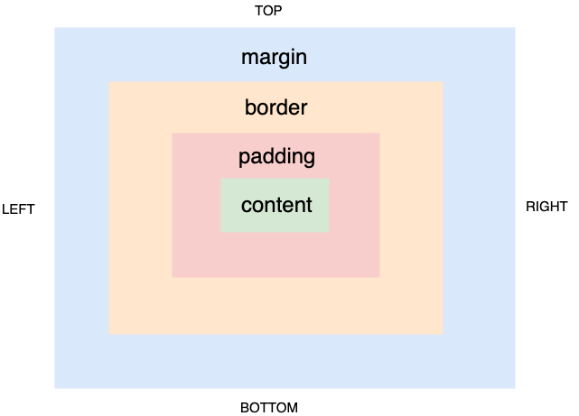

# Cascading Style Sheets (CSS)

CSS provides a way to style HTML tags. CSS was developed to make html
'clean'; that is to separate styles from tags. There are 3 important
concepts in CSS:

1. Properties
2. Values
3. Selectors


The easiest way to add CSS to an html tag is via the `style` attribute.

```html
<TAG_NAME style='prop1:val1; prop2:val2; prop3:val3'>

      content

</TAG_NAME>

```

CSS properties and values are written in pairs seperated by colon (`:`).
These pairs are themselves delimitted by semi-colons(`;`);

The attribute value of `style` is known as *CSS declaration*.


An external CSS file (`.css` extension file) consists on one or more
*CSS Rules*. A CSS rule is
made up of a CSS declaration and a *CSS Selector*.


```html
  CSS Rule:
  <CSS Selector> {
   <CSS Declaration> 
  }
```

We know what CSS declarations look like (value of a `style`
attribute). CSS selectors determine which tags the CSS declaration must
be *applied* to.


## Box model

In order to fully understand CSS properties and values we first need to
understand the CSS *Box Model*.

The Box Model specifies the parts of an HTML tag that can be 'styled':
1. Content
2. Padding
3. Border
4. Margin

     
 <figcaption> Fig: 4.1.1. CSS Box Model</figcaption>               

Each of these can be independently specified for each direction - top,
right, bottom and left.

## Value types

### Distance
For any CSS property that needs to specify distance (e.g. border-width,
height, witdth etc.) it is best to use the following units.

1. *px*: Specifies distance in pixels

```css
  width: 100px;
  height: 100px;
```

<div style='width:100px; height: 100px; background: red'>
</div>

2. *%*: Specifies distance as a percentage of the parent tag

```css
  width: 50%;
  height: 50%;
```
<div style='width:200px; height: 200px;border:dashed 1px'>
<div style='width:50%; height: 50%; background: red'>
</div>
</div>

(parent has width of 200px and height of 200px)

3. *vw/vh*: Specifies distance as a percent of the viewpoet width/height

```css
  width: 30vw;
  height: 20vh;
```

<div style='width:30vw; height: 20vh; background: red'>
</div>

### Color

Color values can be expressed in

1. *Color name*:

2. *Hexadecimal notation*:

3. *RGB format*:

4. *HSL format*:
