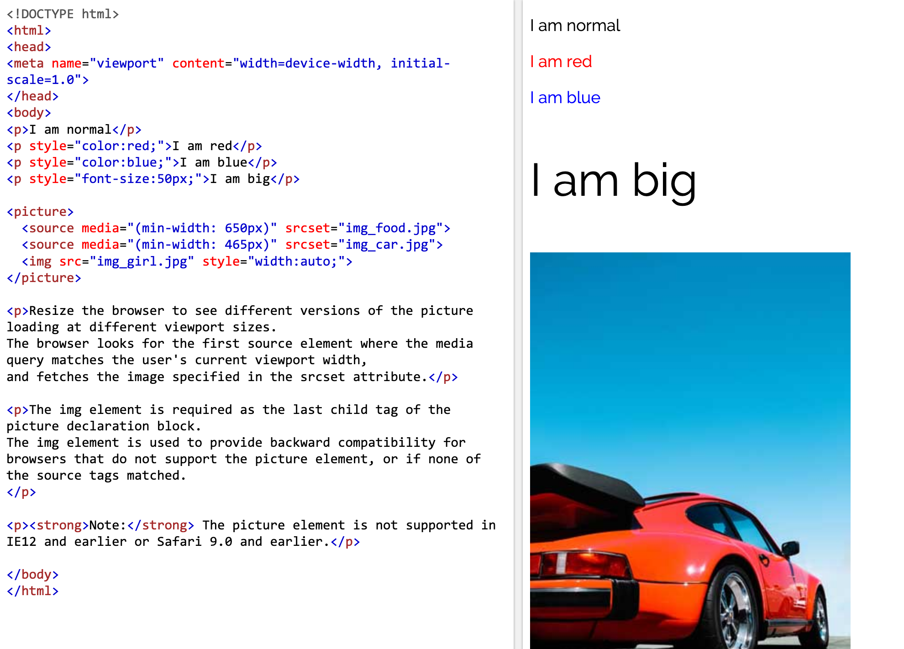

# HTML

Hypertext markup language (HTML) is the lingua franca of the World Wide
Web (www). It is also a medium for designing websites and apps. It is
however NOT a programming language. <i>Then what is HTML?</i> IT is a
<b>document format</b> much like pdf. You can create documents using
HTML, style them using CSS (a sub-set of HTML). But such pages will lack
interaction (like a pdf document). Interactivity can be added by adding
JavaScript to HTML. More on this later.

HTML can be rendered by Browsers like Chrome, Firefox and Safari. In
order to edit html files however we will need a text editor (see Figure
below). It is
convenient to use code editors for this purpose as they provide syntax
highlighting, autocomplete, lint and other tools.

   
 <figcaption> Fig: 2.1.1. HTML Source and Output</figcaption>        

There are 2 main concepts in HTML <b>Tags</b> and
<b>Attributes</b>. 

