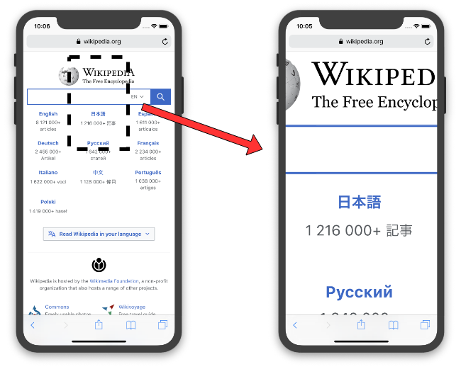

# Other Concepts

## Standalone Tags
HTML tags can be *nested* and this the HTML document has a tree
structure. The root of this tree is the `<html>` tag whose child nodes
are `<head>` and `<body>`. The document then branches out into different
tags. Most tags can have child nodes, however there are a few exceptions
to this. Certain tags are *standalone* i.e. they cannot have child
nodes. Examples of thuch tags are:

- ``
- `<hr>`
- `<input>`
- `<textarea>`

These tags do not need the end tags (like `</img>`, `</hr>` etc.) since
they cannot have content (child nodes).


## Viewport

The `<body>` of the html page renders the `window`, which is the entire
page. However with the advent of mobile devices the contents of the
window can be panned and zoomed. The content (part of the window) that
is now visible to the user is called the `viewport`.

     
 <figcaption> Fig: 3.3.1 Window v/s Viewport</figcaption>               


In the interest of reposive design it makes sense to make the window and
the viewport the same, so we can proceed with web design using only one
size canvas. This can be done by adding the following `<meta>` tag
within the `<head>` of the HTML document.

```html
<meta name="viewport" content="width=device-width, initial-scale=1.0">
```

## `<style>` and `<script>` Tags
You can add CSS declarations directly into the html file using the
`<style>` tag. This will be disucssed in detail in CSS section.

JavaScript can be added directly into the HTML document using the
`<script>` tag.


## Linking External Files
Although both CSS and JavaScriot can be embedded within the HTNL
document it is a good practive to use external files for each. These
external files can be *linked* into the HTML document by using the
`<link>` and `<script>` tags as follows:

```html
 <link rel="stylesheet" href="styles.css">
 <script src="myscripts.js"></script> 
```


## Loading Sequence

The contents of the HTML file loads in the order it is writen
right-to-left and top-to-bottom. This concept becomes important when
styles (in CSS) and variables (in JavaScript) are redefined.
