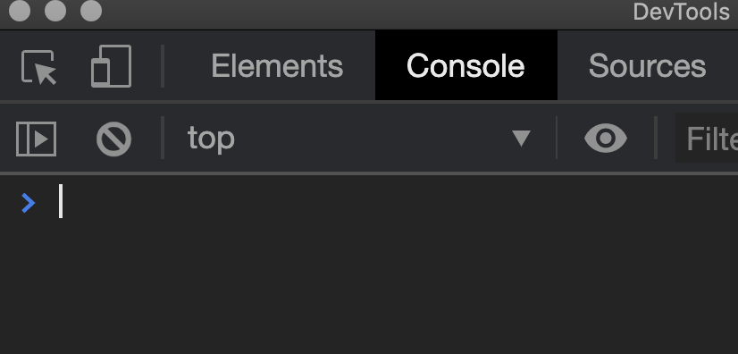
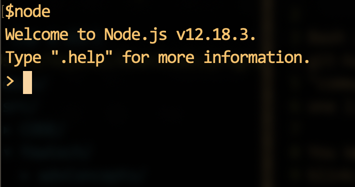

# JavaScript

JavaScript is an Object-Oriented programming language that preserves
C-like syntax. As the name implies it is a scripting language and is
hence interpreted (as opposed to compiled). A **Js Interpreter** is a
program that reads valid JS and executes it one statement at a time
(line-by-line).

JS Intepreters can be stand alone or can be packaged within other
programs like browsers and databse shells. This interpretor can be accessed via the
**console**. In a browser this console can be accessed via the
*Developer Tools*.

     
 <figcaption> Fig: 6.1 Browser Js console (Google Chrome)</figcaption>               

     
 <figcaption> Fig: 6.2 Node.js Console</figcaption>               

All JS within the HTML page is interpreted on this console. The console
understands all valid JS. To try out the console type any airthmetic
expression (say `1+3`) and the console should return the write answer
back.

In the next section we will learn about JS syntax, data types, objects,
functions and other concepts.
