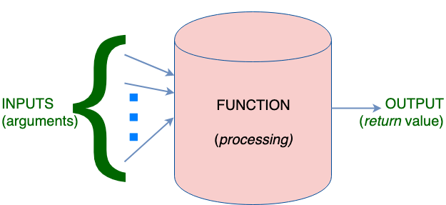

# Functions

Function in JS allow you to reuse code (easy to copy bits)
again-and-again with differemt inputs(known as **arguments**) and
depending ion the input the function does computation (**processing of
statements**) and returns an output (known as **return value**).

     
 <figcaption> Fig: 6.6.1 <code>function()</code> Block Diagram</figcaption>               

Syntactically the function is a code block (a list of statements) that
assume treat input arguments as local variables. It returns an empty
value (when no return statement is found, or there is an empty `return`
statement) or any JS variable. The return value can be captured by a JS
variable.

```js
vat function = <FUNCTION_NAME>(<ARGUMENTS>){
  /*
    Valid JS statements
    to execute
  */

  return; // return undefinied
}
```

Sementically the function is just another variable, hence function names
have the same naming restrictions that is applicable to variables.

Let is consider the following example in which a function converts
temperature from Celcius to Farenheit.

```js
var c2f = function(c)
{
  var f = c * 1.8 + 32;
  return f;
}
```

This function returns the Farenheit value of inpit temperature in
Celcius. It can be invked as follows:

```js
var c = 100;
var f;
f = c2f(c); // 212
f = c2f(56.4); // 133.51999999999998
f = c2f(80.45); // 176.81
```

In order to preserve C like syntax JS allows for the following function
declaration syntax as well:

```js
function <FUNCTION_NAME>( <ARGUMENTS> ){
  /*
    Valid JS statements
    to execute
  */

  return; // return undefinied
}

```


## Built in Functions

### `alert()`
This function takes in a String argument (other variables are typecast
to String) and displays it as a pop-up message
for the user. Try these in your browsers JS console:

```js
alert(1);
alert("hello world")
```

### `confirm()`

This function is used to get `true`/`false` feedback from user. The argument
String is shown as a prompt.

```js
var response = confirm("Yes or No?");
alert(response);
```

### `prompt()`

This function is used to get single line input feedback from user. The argument
String is shown as a prompt.

```js
var response = confirm("Enter your name:");
alert(response);
```

### `console.log()`

This function is used to print debug information into the console. On
the browser this can be accessed via **Developer Tools**. It prints to
console any string given as argument (other data types are typecast).

