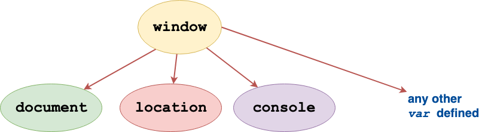

# Objects

Objects are built in data type. An Object is a collection of
**properties**(variables) and **methods**(functions), which are called **members** of the
Object. 

We have already looked at 2 built in
objects -- Strings and Arrays. They both have property `length` and many
different methods. 

Object property and methods can be accessed via the dot (`.`) operator
or through box brackets (`[]`). For example the string property `length`
can be accessed as follows:

```js
var s = "a test string";
var len = s.length; // using dot operator
var len = s["length"]; // using box brackets
```

Similarly any methoids (say `indexOf()`) can be accessed similarly:

```js
var s = "a test string";
var pos = s.indexOf(a); // using dot operator
var pos = s["indexOf"](a); // using box brackets
```


## Object Syntax

```js
var obj = { property_1:   value_1,   // property_# may be an identifier...
            2:            value_2,   // or a number...
            // ...,
            'property n': value_n }; // or a string
```

## Built In Objects

In this section we look at more built in objects.

### `Object` Object

There is a built-in Object called `Object`. This has one useful static
method that we will discuss here. `Object.keys()` returns the list of
all the objects member keys. It is very handy when you want to iterate
the Object.

```js
var keys = Object.keys(location) // can be used to get keys on any
object
for(var i = 0; i < keys.length; i++){
  console.log("Key: " +keys[i]);
  console.log("Key value: " + location[keys[i]]);
}
```

### `date`
The `date` object provides an easy way to store and manipulate dates in
JS.

Each `date` object stores a particular date and time. Instantiating a
`date` object without arguments will give you the current date-time.

```js
var now = new Date();
```

<div class='notes'>

#### <code>new</code> keyword

The `new` keyword is used to create a new object. Notice that we did not
use `new()` to create Arrays and Strings. That is because they are
built-in objects which can be instantiated without `new`(although you
could if you choose).
</div>


As an object `Date()` has built in methods[<a
href='../../bib.html#javascript---the-date-object---tutorialspoint-tutorialspointcom'>Ref</a>]:

<div style='overflow:auto'>

<table>
<tbody><tr>
<th style="text-align:center;">Method 
</th><th>
Description</th></tr>
<tr>

<td>Date()
</td><td>
<p>Returns today's date and time</p></td>
</tr>
<tr>

<td>getDate()
</td><td>
<p>Returns the day of the month for the specified date according to local time.</p></td>
</tr>
<tr>

<td>getDay()
</td><td>
<p>Returns the day of the week for the specified date according to local time.</p></td>
</tr>
<tr>

<td>getFullYear()
</td><td>
<p>Returns the year of the specified date according to local time.</p></td>
</tr>
<tr>

<td>getHours()
</td><td>
<p>Returns the hour in the specified date according to local time.</p></td>
</tr>
<tr>

<td>getMilliseconds()
</td><td><p>Returns the milliseconds in the specified date according to local time.</p></td>
</tr>
<tr>

<td>getMinutes()
</td><td><p>Returns the minutes in the specified date according to local time.</p></td>
</tr>
<tr>

<td>getMonth()
</td><td><p>Returns the month in the specified date according to local time.</p></td>
</tr>
<tr>

<td>getSeconds()
</td><td><p>Returns the seconds in the specified date according to local time.</p></td>
</tr>
<tr>
<td>getTime()
</td><td><p>Returns the numeric value of the specified date as the number of milliseconds since January 1, 1970, 00:00:00 UTC.</p></td>
</tr>
<tr>

<td>getTimezoneOffset()
</td><td><p>Returns the time-zone offset in minutes for the current locale.</p></td>
</tr>
<tr>

<td>getUTCDate()
</td><td><p>Returns the day (date) of the month in the specified date according to universal time.</p></td>
</tr>
<tr>

<td>getUTCDay()
</td><td><p>Returns the day of the week in the specified date according to universal time.</p></td>
</tr>
<tr>

<td>getUTCFullYear()
</td><td><p>Returns the year in the specified date according to universal time.</p></td>
</tr>
<tr>

<td>getUTCHours()
</td><td><p>Returns the hours in the specified date according to universal time.</p></td>
</tr>
<tr>

<td>getUTCMilliseconds()
</td><td><p>Returns the milliseconds in the specified date according to universal time.</p></td>
</tr>
<tr>

<td>getUTCMinutes()
</td><td><p>Returns the minutes in the specified date according to universal time.</p></td>
</tr>
<tr>

<td>getUTCMonth()
</td><td><p>Returns the month in the specified date according to universal time.</p></td>
</tr>
<tr>

<td>getUTCSeconds()
</td><td><p>Returns the seconds in the specified date according to universal time.</p></td>
</tr>
<tr>
<td>getYear()
</td><td><p><b>Deprecated</b> - Returns the year in the specified date according to local time. Use getFullYear instead.</p></td>
</tr>
<tr>

<td>setDate()
</td><td><p>Sets the day of the month for a specified date according to local time.</p></td>
</tr>
<tr>

<td>setFullYear()
</td><td><p>Sets the full year for a specified date according to local time.</p></td>
</tr>
<tr>

<td>setHours()
</td><td><p>Sets the hours for a specified date according to local time.</p></td>
</tr>
<tr>

<td>setMilliseconds()
</td><td><p>Sets the milliseconds for a specified date according to local time.</p></td>
</tr>
<tr>

<td>setMinutes()
</td><td><p>Sets the minutes for a specified date according to local time.</p></td>
</tr>
<tr>

<td>setMonth()
</td><td><p>Sets the month for a specified date according to local time.</p></td>
</tr>
<tr>

<td>setSeconds()
</td><td><p>Sets the seconds for a specified date according to local time.</p></td>
</tr>
<tr>

<td>setTime()
</td><td><p>Sets the Date object to the time represented by a number of milliseconds since January 1, 1970, 00:00:00 UTC.</p></td>
</tr>
<tr>

<td>setUTCDate()
</td><td><p>Sets the day of the month for a specified date according to universal time.</p></td>
</tr>
<tr>
<td>setUTCFullYear()
</td><td><p>Sets the full year for a specified date according to universal time.</p></td>
</tr>
<tr>

<td>setUTCHours()
</td><td><p>Sets the hour for a specified date according to universal time.</p></td>
</tr>
<tr>

<td>setUTCMilliseconds()
</td><td><p>Sets the milliseconds for a specified date according to universal time.</p></td>
</tr>
<tr>

<td>setUTCMinutes()
</td><td><p>Sets the minutes for a specified date according to universal time.</p></td>
</tr>
<tr>

<td>setUTCMonth()
</td><td><p>Sets the month for a specified date according to universal time.</p></td>
</tr>
<tr>

<td>setUTCSeconds()
</td><td><p>Sets the seconds for a specified date according to universal time.</p></td>
</tr>
<tr>

<td>setYear()
</td><td><p><b>Deprecated - </b> Sets the year for a specified date according to local time. Use setFullYear instead.</p></td>
</tr>
<tr>

<td>toDateString()
</td><td><p>Returns the "date" portion of the Date as a human-readable string.</p></td>
</tr>
<tr>

<td>toGMTString()
</td><td><p><b>Deprecated - </b> Converts a date to a string, using the Internet GMT conventions. Use toUTCString instead.</p></td>
</tr>
<tr>

<td>toLocaleDateString()
</td><td><p>Returns the "date" portion of the Date as a string, using the current locale's conventions.</p></td>
</tr>
<tr>
<td>toLocaleFormat()
</td><td><p>Converts a date to a string, using a format string.</p></td>
</tr>
<tr>

<td>toLocaleString()
</td><td><p>Converts a date to a string, using the current locale's conventions.</p></td>
</tr>
<tr>

<td>toLocaleTimeString()
</td><td><p>Returns the "time" portion of the Date as a string, using the current locale's conventions.</p></td>
</tr>
<tr>

<td>toSource()
</td><td><p>Returns a string representing the source for an equivalent Date object; you can use this value to create a new object.</p></td>
</tr>
<tr>

<td>toString()
</td><td><p>Returns a string representing the specified Date object.</p></td>
</tr>
<tr>

<td>toTimeString()
</td><td><p>Returns the "time" portion of the Date as a human-readable string.</p></td>
</tr>
<tr>

<td>toUTCString()
</td><td><p>Converts a date to a string, using the universal time convention.</p></td>
</tr>
<tr>

<td>valueOf()
</td><td><p>Returns the primitive value of a Date object.</p></td>
</tr>
</tbody></table>

</div>


In Addition there are 2 static `Date()` methods[<a
href='../../bib.html#javascript---the-date-object---tutorialspoint-tutorialspointcom'>Ref</a>]:

<div style='overflow:hidden'>

<table>
<tbody><tr>
<th style="text-align:center;">Method 
</th><th>
 Description</th>
</tr>
<tr>

<td><code>Date.parse()</code>
</td><td><p>Parses a string representation of a date and time and returns the internal millisecond representation of that date.</p></td>
</tr>
<tr>

<td><code>Date.UTC()</code>
</td><td><p>Returns the millisecond representation of the specified UTC date and time.</p></td>
</tr>
</tbody></table>


</div>

### `window` Object (browser only)

For browser based JS, the `window` is the topmost object. All other
objects and variables are derived from the `window` object.

     
 <figcaption> Fig: 6.5.1 <code>window</code> Object</figcaption>               

Therefore when we write `console.log()` it is interpreted as
`window.console.log()`.

The window object encapsulates other important objects such as --
`location` (which has useful members such as `location.href`,
`location.hash`, `location.host`,  `location.reload()` etc.) and
`document`.
 
### `document` Object (browser only)

<div class='notes'>

#### Document Object Model (DOM)

</div>


<div class='notes'>

#### What about jQuery?

</div>


