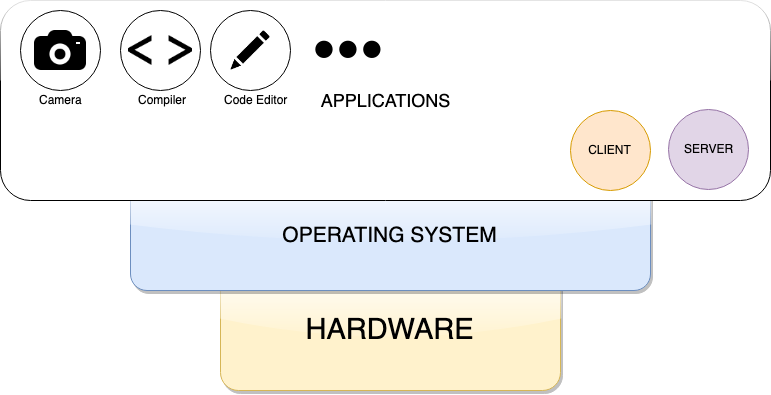

# Programmer's Model of a Computer

We now know that clients and servers can communicate with one another
using the client server model. But <i>where within the nodes of the Internet
(computers, phones, tablets) do clients and servers exist?</i>.

|       |
| :--:                                                                     | 
| <figcaption> Fig: 1.1.2.1. Programmer's model of a Computer</figcaption> |  

Clients and servers are applications that reside in the application
layer of a computer (see Figure below). For eg. Github.com is a server which can be
accessed via a web browser (on computers and phones) or apps (also on
computers and phone). Other examples include YouTube.com, Slack,
Facebook, Google etc. All these "Internet Software" have a server and
client apps as part of their ecosystem. Developing and maintaining these
is referred to as <b>devops</b> (Developer Operations).

This book is a guide to train you in devops for Internet Software.
Chapter 3 of the book deals with deploying clients and servers on
Microcontrollers (small bare bones computers with no OS, but programmable
firmware).
