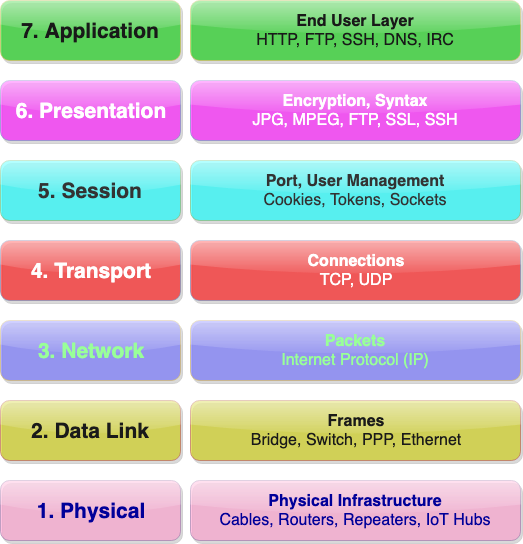

# The Internet

We all have a working definition of what
<i>Internet</i> means to us. However, just like there are different ways to
visualize a computer (as seen in last section), the Internet can
defined using different deinitions. These definitions are related by a
hierarchy called the Open Systems Interconnection (OSI) Model. 

|  | 
| :--:                                                              |  
| <figcaption> Fig: 1.1.3.1. OSI Model of Internet</figcaption>     |   

To learn more about the OSI model please read this:
<https://en.wikipedia.org/wiki/OSI_model>
