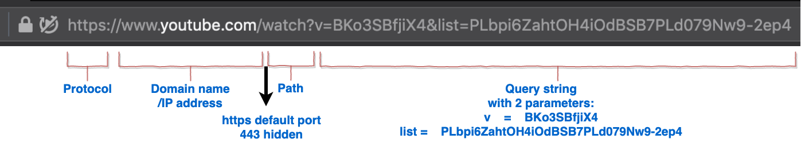
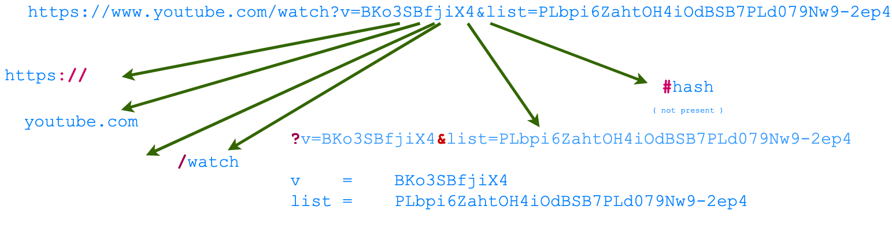
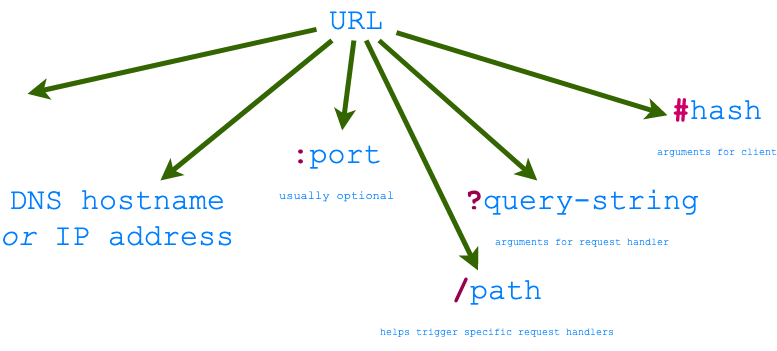

# Uniform Resorce Locator (URL)

The client <i>addresses</i> the server and embed all the parameters of
the request using the URL. The Figure below shows an example of a URL.

|  |   |
| :--:                                                               |   |
| <figcaption> Fig: 1.2.4.1 URL example</figcaption>                 |   |

The URL provides the following basic information in order to route the
request to the right server:

0. Protocol scheme (http or https in case of websites/apps).
1. IP address (or DNS name which resolves to an IP address), which is
   unique to every computer including the server.
2. Port. This allows request to be sent to different server programs on
   the same computer. 
3. Path, invoking the right request handler in the server.
4. a query string that provides arguments to the request handler in
   key-value pairs.

|  |   |
| :--:                                                               |   |
| <figcaption> Fig: 1.2.4.3 Parts of a URL</figcaption>              |   |

Routing these request correctly is what
makes youtube.com respond with the video. 

The figure below shows the parts of a generic URL.

|  |   |
| :--:                                                                    |   |
| <figcaption> Fig: 1.2.4.2 URL Grammar</figcaption>                      |   |

