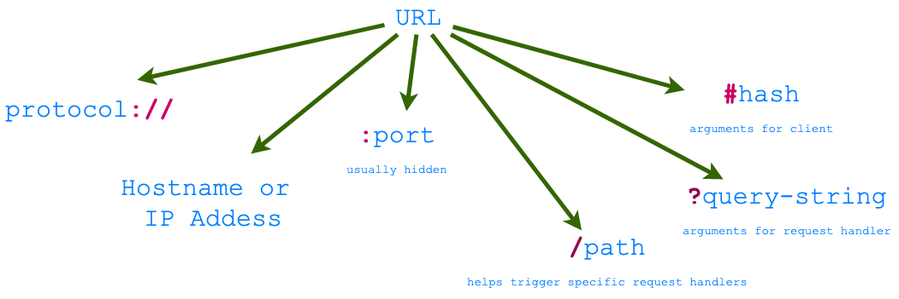

# Uniform Resource Locator (URL)

The URL encodes *request* data that the client sends to a server.
The client <i>addresses</i> the server and embeds all other parameters of
the request in a URL. The Figures below shows an example of a URL, and
components that make up a URL.

     
 <figcaption> Fig: 1.4.1 URL example</figcaption>                    

     
 <figcaption> Fig: 1.4.2 Parts of a URL</figcaption>                 

The URL provides the following basic information in order to route the
request to the right server:

1. **Protocol scheme** (`http` or `https` in case of websites/apps).
2. **IP address** (or **DNS name** which resolves to an IP address), which is
   unique to every computer including servers.
3. **Port**. This allows request to be sent to different server programs on
   the same computer. Hidden in case of http/https and defaults to
80/443. 
4. **Path**, invoking the right request handler in the server.
5. A **query string** that provides arguments to the request handler in
   key-value pairs.

Routing these request correctly is what
makes youtube.com respond with the video. Depending on the video ID
(argument `v`) a
different video is served. A playlist is displayed if a valid `list`
argument is present. Try opeing the following 2 urls:
1. <https://www.youtube.com/watch?v=BKo3SBfjiX4&list=PLbpi6ZahtOH4iOdBSB7PLd079Nw9-2ep4>
2. <https://www.youtube.com/watch?v=BKo3SBfjiX4>

Can you notice the difference?

The Figure below shows the parts of a generic URL.

     
 <figcaption> Fig: 1.4.3 URL Grammar</figcaption>                         

