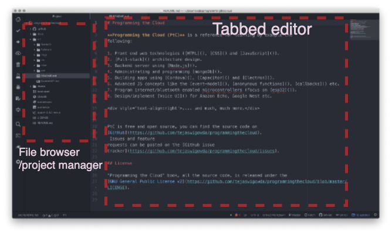

# Editing Code

The examples in this book will need you to edit code/document format
files (HTML, CSS, JS, C++ etc.). You can use any editor you are
comfortable with. It is recommended that you use an editir with syntax
highlighting.

Here is a list of recommended code editors
- [Atom](https://atom.io/)
- [Brackets](http://brackets.io/)
- [Sublime](https://www.sublimetext.com/3)
- [TextMate](https://macromates.com/)
- VI (use in bash)
- Emacs (use in bash)

The first 4 are visual editors with a 
simple to use with a user-friendly GUI. VI and EMACS on the other has
are command-line (bash) editors. This will come in handy when you need
to edit on a remote machine. However both have steep learning curves and
will take practice to perfect. If you are new to programming this book
suggests you start with Atom Editor (first choice in the above list). It
has a tabbed editor and a project manager pane (Figure 1.2.3.1). You can easily add new
files, manage folders and edit/modify/save individual files.

     
 <figcaption> Fig: 1.2.3.1 Atom Editor </figcaption>               
