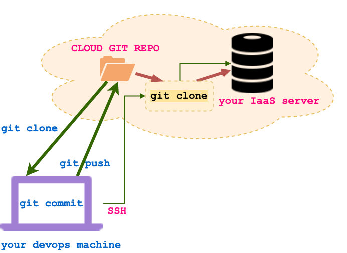

# Code Deployment

Some of the code examples (usually server or db management) need to be
deployed on a remote machine provisioned by you (you can provision such
machines using IaaSs like Amazon Web Services, Google Cloud Compute, Ali
Yun, Microsoft Azure and others).

When you provision a Linux machine on these remote servers you only have
shell access via SSH. In such circumstances use a cloud git repository
to transfer your development code to the remote server. The figure below
sketches this workflow.

     
 <figcaption> Fig: 1.2.4.1. Deploy server code to IaaS server</figcaption> 

