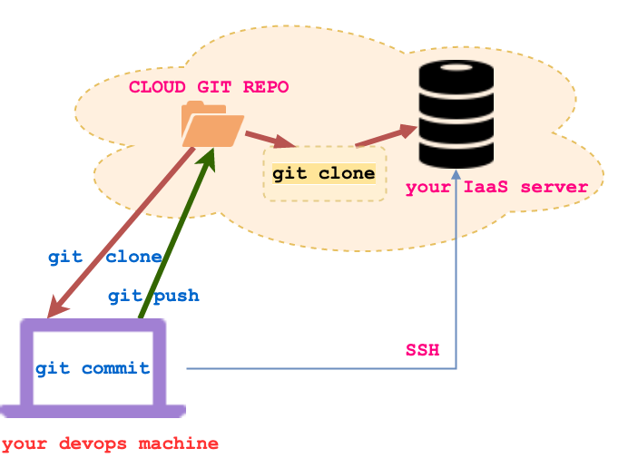

# Code Deployment

Some of the code examples (usually server or db management) need to be
deployed on a remote machine provisioned by you (you can provision such
machines using IaaSs like <a href='https://aws.amazon.com/'>Amazon Web
Services</a>, <a href='https://cloud.google.com/'>Google Cloud
Compute</a>, <a href='https://alibabacloud.com/'>Ali
Yun</a>, <a href='https://azure.microsoft.com/'>Microsoft Azure</a> and others).

When you provision a Linux machine on these remote servers you only have
shell access via SSH. In such circumstances use a cloud git repository
to transfer your development code to the remote server. The figure below
sketches this workflow.

     
 <figcaption> Fig: 2.6.1. Deploy server code to IaaS server</figcaption> 

