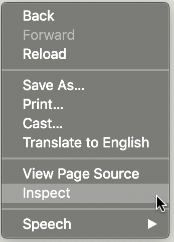
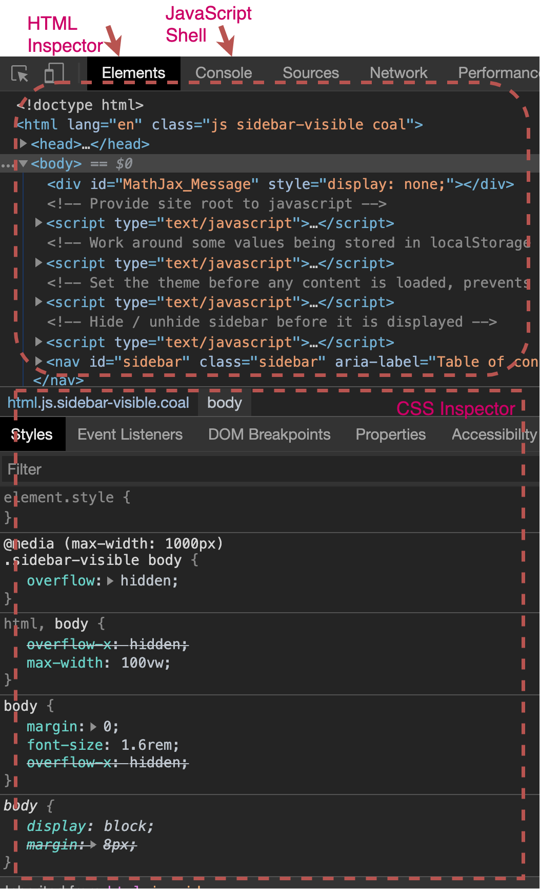

# Browser Developer Tools

In order to bring up the development tools, right-click anywhere on the
html document. You should be able to choose <i>inspect</i> from the
context menu that appears.

     
 <figcaption> Fig: 2.1.1.1. Trigger inspector for contect menu
(right-click)</figcaption>              

     
 <figcaption> Fig: 2.1.1.2. Developer Tools
</figcaption>              

